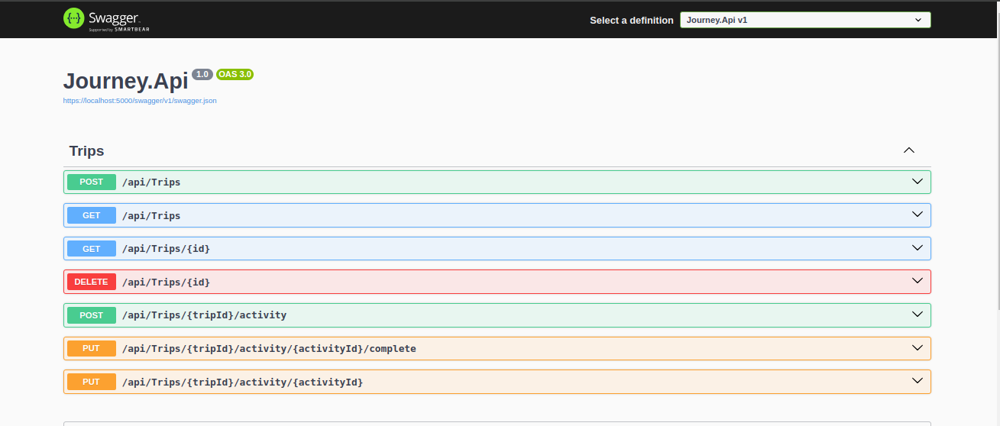
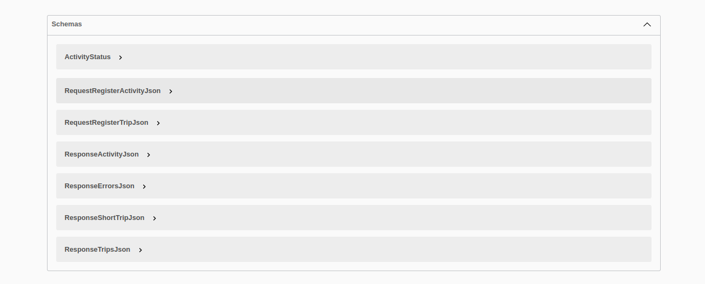

Aplicação desenvolvida no NLW Journey da Rocketseat na trilha C#.

  <a href="#-tecnologias">Tecnologias</a>&nbsp;&nbsp;&nbsp;|&nbsp;&nbsp;&nbsp;
  <a href="#-projeto">Projeto</a>&nbsp;&nbsp;&nbsp;|&nbsp;&nbsp;&nbsp;
  <a href="#memo-licença">Licença</a>

  

 

  

  

## Para executar o código de teste, utilizamos o seguinte comando:

`dotnet run`

## 🚀 Tecnologias

Esse projeto foi desenvolvido com as seguintes tecnologias:

- .NET, ASP NET CORE
- C#
- Entity Framework, XUnit

## Projeto

Back-end da aplicação plann.er construída durante o NLW Journey da Rocketseat.